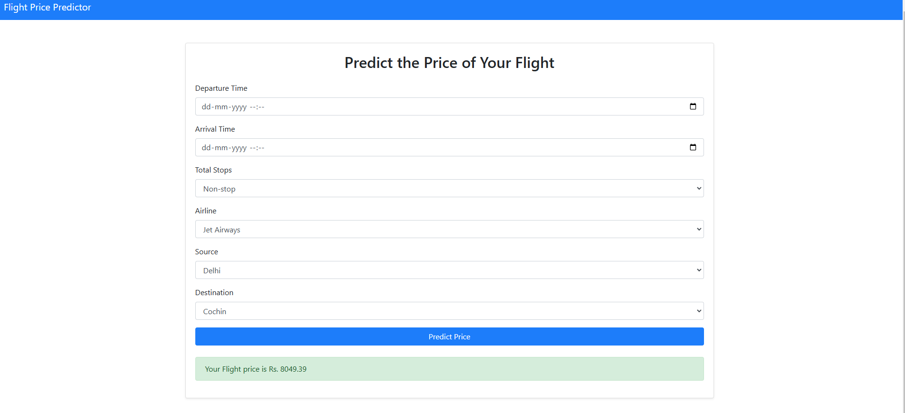

# Flight-Price-predictor




## 📋 Table of Contents

1. 🤖 [Introduction](https://chatgpt.com/c/67b970ba-1804-8003-b915-5c90c78d68b3#introduction)
2. ⚙️ [Tech Stack](https://chatgpt.com/c/67b970ba-1804-8003-b915-5c90c78d68b3#tech-stack)
3. 🔋 [Features](https://chatgpt.com/c/67b970ba-1804-8003-b915-5c90c78d68b3#features)
4. 🤸 [Quick Start](https://chatgpt.com/c/67b970ba-1804-8003-b915-5c90c78d68b3#quick-start)
5. 🕸️ [Snippets](https://chatgpt.com/c/67b970ba-1804-8003-b915-5c90c78d68b3#snippets)

## 🤖 Introduction

The **Flight Price Predictor** is a Flask-based web application that uses machine learning techniques to predict airline ticket prices based on various input parameters. The model is trained on historical flight data and utilizes advanced regression techniques to provide accurate price estimates.

## ⚙️ Tech Stack

* Flask
* Python
* Scikit-Learn
* Pandas
* NumPy
* Matplotlib

## 🔋 Features

👉  **Machine Learning Model** : Implements regression models to predict flight prices based on historical data.

👉  **User-Friendly Web Interface** : Built with Flask to provide an intuitive UI for users to input flight details.

👉  **Data Preprocessing** : Cleans and transforms raw data to improve model accuracy.

👉  **Feature Engineering** : Extracts key features from flight datasets to enhance prediction performance.

👉  **Graphical Visualization** : Displays insights using Matplotlib for better data understanding.

👉  **Scalability** : Can be extended with additional data sources or improved models.

## 🤸 Quick Start

Follow these steps to set up and run the project locally.

### **Prerequisites**

Ensure you have the following installed:

* [Git](https://git-scm.com/)
* [Python 3.8+](https://www.python.org/)
* [pip](https://pip.pypa.io/en/stable/)

### **Cloning the Repository**

```bash
git clone https://github.com/Ayush110103/Flight-Price-predictor.git
cd Flight-Price-predictor
```

### **Installation**

Create a virtual environment and install dependencies:

```bash
python -m venv venv
source venv/bin/activate  # On Windows use `venv\Scripts\activate`
pip install -r requirements.txt
```

### **Running the Project**

```bash
python app.py
```

The Flask app will start running at `http://127.0.0.1:5000/`.

## 🕸️ Snippets

### **Example API Request**

```python
import requests

url = "http://127.0.0.1:5000/predict"
data = {
    "airline": "Indigo",
    "source": "Delhi",
    "destination": "Mumbai",
    "departure_time": "08:00",
    "duration": 2.5,
    "stops": 0
}

response = requests.post(url, json=data)
print(response.json())
```

### **Example Model Training Script**

```python
from sklearn.ensemble import RandomForestRegressor
from sklearn.model_selection import train_test_split
import pandas as pd

# Load dataset
data = pd.read_csv("flights_data.csv")

# Preprocessing and feature engineering (as required)
X = data.drop(columns=["Price"])
y = data["Price"]

# Splitting dataset
X_train, X_test, y_train, y_test = train_test_split(X, y, test_size=0.2, random_state=42)

# Train model
model = RandomForestRegressor(n_estimators=100)
model.fit(X_train, y_train)

# Save model
import joblib
joblib.dump(model, "flight_price_model.pkl")
```

### **Example Flask Route for Prediction**

```python
from flask import Flask, request, jsonify
import joblib
import pandas as pd

app = Flask(__name__)
model = joblib.load("flight_price_model.pkl")

@app.route("/predict", methods=["POST"])
def predict():
    data = request.get_json()
    df = pd.DataFrame(data, index=[0])
    prediction = model.predict(df)
    return jsonify({"predicted_price": prediction[0]})

if __name__ == "__main__":
    app.run(debug=True)
```

## 📌 Contributing

Contributions are welcome! If you'd like to improve the project, feel free to fork the repository, make changes, and submit a pull request.

---

🔗 **Connect with me:**

[](https://my-portfolio-olive-beta-16.vercel.app/)

[](https://github.com/Ayush110103)

[](https://linkedin.com/in/ayushjain1101)
